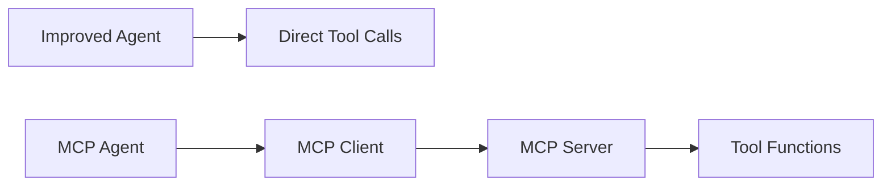
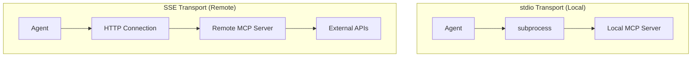
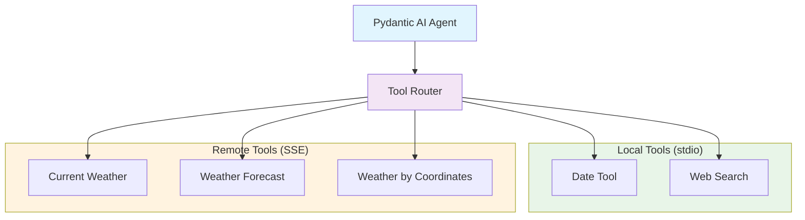
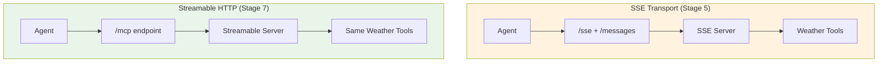

# 🎓 MCP Transition Tutorial: Step-by-Step Code Walkthrough

This comprehensive guide walks through each stage of the MCP transition, highlighting key code changes, architectural decisions, and learning points. Each section includes color-coded diffs and detailed explanations.

---

## 📋 Table of Contents

1. [Stage 1 → 2: From Naive to Improved](#stage-1--2-from-naive-to-improved)
2. [Stage 2 → 3: Introducing MCP Protocol](#stage-2--3-introducing-mcp-protocol)
3. [Stage 3 → 4: Official Library Adoption](#stage-3--4-official-library-adoption)
4. [Stage 4 → 5: Remote Services with SSE](#stage-4--5-remote-services-with-sse)
5. [Stage 5 → 6: Multi-Transport Architecture](#stage-5--6-multi-transport-architecture)
6. [Stage 5 → 7: SSE to Streamable HTTP Migration](#stage-5--7-sse-to-streamable-http-migration)

---

## Stage 1 → 2: From Naive to Improved

**Focus**: Async patterns, code quality, and maintainable architecture

### Key Changes Overview

| Aspect | Naive Agent | Improved Agent |
|--------|-------------|----------------|
| **Async Pattern** | Manual event loop creation | Proper async/await |
| **Error Handling** | Basic try/catch | Specific exception handling |
| **Type Hints** | Minimal | Comprehensive |
| **Code Structure** | Functional | Clean, modular |

### 🔧 Architecture Changes

#### **1. Async Pattern Evolution**

**❌ Naive Approach:**
```python
# Manual event loop management - problematic and complex
def chat(self, message):
    try:
        # Create new event loop
        loop = asyncio.new_event_loop()
        asyncio.set_event_loop(loop)
        
        # Run the async function in the loop
        result = loop.run_until_complete(
            self.agent.run(message, deps=message, message_history=self.messages)
        )
        
        # Close the loop
        loop.close()
```

**✅ Improved Approach:**
```python
# Clean async method - proper coroutine
async def chat(self, message: str) -> str:
    try:
        result = await self.agent.run(
            message,
            message_history=self.messages
        )
```

**💡 Learning Point**: Manual event loop management is error-prone and unnecessary. Modern Python async patterns are cleaner and more reliable.

#### **2. Tool Function Patterns**

**❌ Naive Tool Registration:**
```python
@self.agent.tool
async def date_tool(ctx: RunContext[str]) -> str:
    """Get the current date"""
    today = date.today()
    return today.strftime("%B %d, %Y")
```

**✅ Improved Tool Registration:**
```python
@self.agent.tool
def date_tool(ctx: RunContext[str]) -> str:  # Removed unnecessary async
    """Get the current date"""
    today = date.today()
    return today.strftime("%B %d, %Y")
```

**💡 Learning Point**: Tools should only be async when they perform I/O operations. Date calculation is synchronous.

#### **3. Error Handling Evolution**

**❌ Generic Error Handling:**
```python
except Exception as e:
    print(f"Error in chat: {e}")
    return "Sorry, I encountered an error processing your request."
```

**✅ Specific Error Handling:**
```python
@self.agent.tool
def web_search(ctx: RunContext[str], query: str) -> str:
    try:
        search_response = tavily_client.search(query)
        # ... processing ...
        return results_json
    except Exception as e:
        return f"Search failed: {str(e)}"  # Tool-specific error
```

### 📊 Impact Summary

- **Code Reduction**: ~15 lines removed (nest_asyncio, manual loop management)
- **Maintainability**: ⬆️ Type hints and clear async patterns
- **Reliability**: ⬆️ Better error handling and resource management
- **Performance**: ⬆️ Proper async execution without loop overhead

---

## Stage 2 → 3: Introducing MCP Protocol

**Focus**: Protocol abstraction, tool discovery, and client-server architecture

### Key Architectural Shift



This stage introduces the foundational MCP concepts through two new files:

### 🔧 New Component: MCP Server (`mcp_server_stdio.py`)

#### **Tool Registration Pattern**

```python
@server.list_tools()
async def handle_list_tools() -> list[types.Tool]:
    """Dynamic tool discovery endpoint"""
    return [
        types.Tool(
            name="date_tool",
            description=(
                "Get the current date in a human-readable format (Month Day, Year). "
                "Use this tool when you need to know today's date for scheduling, "
                "time-sensitive queries, or providing temporal context."
            ),
            inputSchema={
                "type": "object",
                "properties": {},
                "required": []
            }
        ),
        # ... more tools
    ]
```

**💡 Learning Point**: MCP servers expose tool **metadata** separately from implementation, enabling dynamic discovery.

#### **Tool Execution Pattern**

```python
@server.call_tool()
async def handle_call_tool(name: str, arguments: dict[str, Any] | None) -> list[types.TextContent]:
    """Route tool calls to appropriate functions"""
    if name == "date_tool":
        result = await date_tool()
        return [types.TextContent(type="text", text=result)]
    elif name == "web_search":
        query = arguments.get("query")
        if not query:
            raise ValueError("Query parameter is required for web_search")
        result = await web_search(query)
        return [types.TextContent(type="text", text=result)]
```

**💡 Learning Point**: MCP provides structured request/response with parameter validation and typed content.

### 🔧 New Component: MCP Client (`mcp_client_stdio.py`)

#### **Session Lifecycle Management**

```python
async def start(self) -> None:
    """Initialize MCP server subprocess and session"""
    # Start server process
    self.process = subprocess.Popen(
        [sys.executable, self.server_script_path],
        stdin=subprocess.PIPE,
        stdout=subprocess.PIPE,
        stderr=subprocess.PIPE,
        text=True,
        bufsize=0
    )
    
    # Perform MCP handshake
    await self._initialize_session()
```

#### **Protocol Implementation**

```python
async def _send_message(self, message: Dict[str, Any]) -> Dict[str, Any]:
    """JSON-RPC 2.0 message handling"""
    message["id"] = self.message_id
    self.message_id += 1
    
    message_json = json.dumps(message) + "\n"
    self.process.stdin.write(message_json)
    self.process.stdin.flush()
    
    response_line = self.process.stdout.readline()
    return json.loads(response_line)
```

**💡 Learning Point**: MCP uses JSON-RPC 2.0 over various transports. The client handles protocol details transparently.

### 🎯 Tool Discovery vs Static Registration

#### **Before: Static Tool Registration**
```python
# In improved_agent.py - tools are hardcoded
@self.agent.tool
def date_tool(ctx: RunContext[str]) -> str:
    # Implementation directly in agent
```

#### **After: Dynamic Tool Discovery**
```python
# In mcp_client_stdio.py - tools discovered at runtime
async def list_tools(self) -> List[Dict[str, Any]]:
    """Discover available tools from server"""
    message = {"jsonrpc": "2.0", "method": "tools/list"}
    response = await self._send_message(message)
    return response.get("result", {}).get("tools", [])
```

### 📊 Architecture Benefits

| Aspect | Before MCP | With MCP |
|--------|------------|----------|
| **Tool Location** | Embedded in agent | Separate server process |
| **Discovery** | Static, compile-time | Dynamic, runtime |
| **Reusability** | Agent-specific | Cross-agent, cross-language |
| **Deployment** | Monolithic | Distributed, scalable |
| **Maintenance** | Coupled | Decoupled |

---

## Stage 3 → 4: Official Library Adoption

**Focus**: Replacing custom implementation with production-ready SDK

### Code Reduction Analysis

This transition demonstrates the value of mature libraries:

#### **Before: Custom Client (150+ lines)**
```python
class MCPClient:
    def __init__(self, server_script_path: str, logger: Optional[logging.Logger] = None):
        self.server_script_path = server_script_path
        self.process: Optional[subprocess.Popen] = None
        self.message_id = 0
        # ... extensive setup
    
    async def _send_message(self, message: Dict[str, Any]) -> Dict[str, Any]:
        # Manual JSON-RPC implementation
        message["id"] = self.message_id
        self.message_id += 1
        message_json = json.dumps(message) + "\n"
        # ... 20+ lines of protocol handling
    
    async def _initialize_session(self) -> None:
        # Manual MCP handshake
        init_message = {
            "jsonrpc": "2.0",
            "method": "initialize",
            "params": {
                "protocolVersion": "2024-11-05",
                # ... detailed handshake
            }
        }
        # ... handshake logic
```

#### **After: Official Library (20 lines)**
```python
# Simple, clean connection setup
server_params = StdioServerParameters(
    command="python",
    args=[self.mcp_server_path],
    env=None
)

stdio_transport = await self.exit_stack.enter_async_context(
    stdio_client(server_params)
)
read_stream, write_stream = stdio_transport

self.session = await self.exit_stack.enter_async_context(
    ClientSession(read_stream, write_stream)
)

await self.session.initialize()  # One line!
```

### 🔄 Migration Changes

#### **1. Import Changes**
```python
# ❌ Custom implementation
from custom_mcp_client import MCPClient

# ✅ Official library
from mcp import ClientSession, StdioServerParameters
from mcp.client.stdio import stdio_client
```

#### **2. Connection Management**
```python
# ❌ Manual process management
async with MCPClient("mcp_server_stdio.py") as client:
    tools = await client.list_tools()
    result = await client.call_tool("tool_name", {"param": "value"})

# ✅ Library-managed resources
async with stdio_client(server_params) as (read_stream, write_stream):
    async with ClientSession(read_stream, write_stream) as session:
        await session.initialize()
        tools = await session.list_tools()
        result = await session.call_tool("tool_name", arguments={"param": "value"})
```

#### **3. Tool Discovery Simplification**
```python
# ❌ Manual response parsing
tools_response = await self._send_message({"jsonrpc": "2.0", "method": "tools/list"})
tools = tools_response.get("result", {}).get("tools", [])

# ✅ Library abstraction
tools_response = await self.session.list_tools()
tools = tools_response.tools  # Clean, typed access
```

### 📊 Benefits Summary

| Metric | Custom Implementation | Official Library |
|--------|----------------------|------------------|
| **Lines of Code** | ~400 lines | ~200 lines |
| **Error Handling** | Manual, incomplete | Comprehensive, tested |
| **Protocol Compliance** | Best-effort | Specification-compliant |
| **Maintenance** | High (custom code) | Low (library updates) |
| **Features** | Basic | Full MCP feature set |

**💡 Key Takeaway**: Use official libraries when available. They provide better reliability, maintenance, and feature completeness.

---

## Stage 4 → 5: Remote Services with SSE

**Focus**: HTTP-based transport, external API integration, production deployment

### Transport Evolution



### 🌐 New Server: Weather Service (`mcp_server_sse.py`)

#### **Transport Layer Changes**

```python
# ❌ stdio server (process-based)
async def main():
    async with mcp.server.stdio.stdio_server() as (read_stream, write_stream):
        await server.run(read_stream, write_stream, init_options)

# ✅ SSE server (HTTP-based)
async def main():
    sse_transport = SseServerTransport("/messages")
    
    async def app(scope, receive, send):
        if scope["path"] == "/sse" and scope["method"] == "GET":
            async with sse_transport.connect_sse(scope, receive, send) as streams:
                read_stream, write_stream = streams
                await server.run(read_stream, write_stream, init_options)
    
    # Run with uvicorn HTTP server
    config = uvicorn.Config(app, host="127.0.0.1", port=8000)
    server_instance = uvicorn.Server(config)
    await server_instance.serve()
```

**💡 Learning Point**: SSE transport enables remote deployment, load balancing, and horizontal scaling.

#### **External API Integration Pattern**

```python
async def make_weather_request(endpoint: str, params: Dict[str, Any]) -> Dict[str, Any]:
    """Reusable API client with error handling"""
    params["appid"] = OPENWEATHERMAP_API_KEY
    params["units"] = "metric"
    
    async with aiohttp.ClientSession() as session:
        async with session.get(f"{WEATHER_API_BASE}/{endpoint}", params=params) as response:
            if response.status == 200:
                return await response.json()
            elif response.status == 404:
                raise WeatherAPIError("City not found. Please check the city name.")
            # ... comprehensive error handling
```

**💡 Learning Point**: MCP servers can integrate with any external service, making them powerful API aggregators.

#### **Structured Data Return Pattern**

```python
def extract_current_weather(data: Dict[str, Any]) -> Dict[str, Any]:
    """Transform API response into LLM-friendly structure"""
    return {
        "location": {
            "city": data.get("name", "Unknown"),
            "country": data.get("sys", {}).get("country"),
            "coordinates": {
                "latitude": data.get("coord", {}).get("lat"),
                "longitude": data.get("coord", {}).get("lon")
            }
        },
        "weather": {
            "main": data["weather"][0]["main"],
            "description": data["weather"][0]["description"],
        },
        "temperature": {
            "current": round(data["main"]["temp"], 1),
            "feels_like": round(data["main"]["feels_like"], 1),
        }
        # ... structured for LLM consumption
    }
```

**💡 Learning Point**: Structure data for optimal LLM interpretation rather than raw API responses.

### 🔧 Client Changes: SSE Connection (`mcp_agent_sse.py`)

#### **Connection Pattern Evolution**

```python
# ❌ stdio connection (subprocess)
server_params = StdioServerParameters(
    command="python",
    args=[self.mcp_server_path]
)
stdio_transport = await stdio_client(server_params)

# ✅ SSE connection (HTTP)
sse_transport = await sse_client(self.server_url)  # Just a URL!
```

#### **Health Check Pattern**

```python
async def test_weather_server() -> bool:
    """Verify server availability before connecting"""
    try:
        async with aiohttp.ClientSession() as session:
            async with session.get("http://localhost:8000/sse", timeout=2) as response:
                return response.status == 200
    except Exception as e:
        print(f"❌ Cannot connect to SSE server: {e}")
        return False
```

### 📊 Deployment Comparison

| Aspect | stdio Transport | SSE Transport |
|--------|----------------|---------------|
| **Connection** | subprocess launch | HTTP URL |
| **Scalability** | Single process | Multiple clients |
| **Deployment** | Local only | Local or remote |
| **Load Balancing** | Not applicable | Standard HTTP LB |
| **Monitoring** | Process monitoring | HTTP monitoring |
| **Security** | Process isolation | HTTP/TLS |

---

## Stage 5 → 6: Multi-Transport Architecture

**Focus**: Unified tool interface, session management, distributed tool composition

### Architecture Overview



### 🔧 Session Management

#### **Multiple Connection Initialization**

```python
async def start(self) -> None:
    """Initialize both transport connections"""
    print("🔌 Starting multi-transport MCP connections...")
    
    # Start stdio connection (local tools)
    await self._start_stdio_connection()
    
    # Start SSE connection (remote weather service)  
    await self._start_sse_connection()
    
    # Discover and register all tools from both servers
    await self._discover_all_tools()
```

#### **Tool-to-Session Mapping**

```python
# Track which session handles each tool
self.tool_to_session: Dict[str, ClientSession] = {}

# During discovery
for tool in stdio_tools.tools:
    self.tool_to_session[tool.name] = self.stdio_session
    
for tool in sse_tools.tools:
    self.tool_to_session[tool.name] = self.sse_session
```

### 🎯 Universal Tool Wrapper

#### **Intelligent Routing Pattern**

```python
async def mcp_tool_wrapper(ctx: RunContext[str], **kwargs) -> str:
    """Universal wrapper that routes tool calls to correct session"""
    try:
        # Find which session handles this tool
        session = self.tool_to_session.get(tool_name)
        if not session:
            return f"Error: No session found for tool {tool_name}"
        
        # Execute tool on the appropriate session
        result = await session.call_tool(tool_name, arguments=kwargs)
        
        # Extract content (same pattern for all transports)
        if result.content and len(result.content) > 0:
            first_content = result.content[0]
            if hasattr(first_content, 'text'):
                return first_content.text
        
        return "No content returned from tool"
        
    except Exception as e:
        return f"Tool execution failed: {e}"
```

**💡 Learning Point**: The tool wrapper abstracts transport differences, providing a unified interface to the agent.

### 📊 Tool Distribution Visibility

```python
# Show tool distribution to user
stdio_tools = [t for t, s in self.tool_to_session.items() if s == self.stdio_session]
sse_tools = [t for t, s in self.tool_to_session.items() if s == self.sse_session]

print(f"   📍 Local (stdio): {stdio_tools}")
print(f"   🌐 Remote (SSE): {sse_tools}")
```

### 🔧 System Prompt Enhancement

```python
def _update_system_prompt(self) -> None:
    """Group tools by source for clear agent understanding"""
    stdio_tools = [t for t in self.available_tools if t["source"] == "stdio"]
    sse_tools = [t for t in self.available_tools if t["source"] == "sse"]
    
    tool_descriptions = []
    
    if stdio_tools:
        tool_descriptions.append("\nLocal tools (stdio):")
        for tool in stdio_tools:
            tool_descriptions.append(f"- {tool['name']}: {tool['description']}")
    
    if sse_tools:
        tool_descriptions.append("\nRemote tools (SSE):")
        for tool in sse_tools:
            tool_descriptions.append(f"- {tool['name']}: {tool['description']}")
```

**💡 Learning Point**: The agent understands tool distribution, which can inform its decision-making about tool usage.


---

## Stage 5 → 7: SSE to Streamable HTTP Migration

**Focus**: Transport evolution, single endpoint architecture, and protocol modernization

### Transport Evolution



### 🔧 Server Transport Changes

#### **Transport Initialization**

**❌ SSE Transport:**
```python
# Dual-endpoint complexity
from mcp.server.sse import SseServerTransport

sse_transport = SseServerTransport("/messages")

if path == "/sse" and method == "GET":
    async with sse_transport.connect_sse(scope, receive, send) as streams:
        read_stream, write_stream = streams
        await server.run(read_stream, write_stream, init_options)
elif path == "/messages" and method == "POST":
    await sse_transport.handle_post_message(scope, receive, send)
```

**✅ Streamable HTTP Transport:**
```python
# Single-endpoint simplicity
from mcp.server.streamable_http import StreamableHTTPServerTransport

streamable_transport = StreamableHTTPServerTransport(
    mcp_session_id=None,
    is_json_response_enabled=False,
    event_store=None
)

if path == "/mcp" and method in ["POST", "GET", "DELETE"]:
    await streamable_transport.handle_request(scope, receive, send)
```

**💡 Learning Point**: Streamable HTTP uses a single endpoint `/mcp` instead of separate `/sse` and `/messages` endpoints.

#### **Architecture Pattern**

```python
# Streamable HTTP: Connect pattern + HTTP handling
async with streamable_transport.connect() as (read_stream, write_stream):
    async with asyncio.TaskGroup() as tg:
        tg.create_task(server_instance.serve())  # HTTP server
        tg.create_task(server.run(               # MCP session
            read_stream, write_stream, init_options
        ))
```

**💡 Learning Point**: The server uses both `handle_request()` for HTTP and `connect()` for MCP session management.

### 🔧 Client Migration Changes

#### **Connection Pattern**

**❌ SSE Client:**
```python
from mcp.client.sse import sse_client

sse_transport = await self.exit_stack.enter_async_context(
    sse_client("http://localhost:8000/sse")
)
read_stream, write_stream = sse_transport  # 2 values
```

**✅ Streamable HTTP Client:**
```python
from mcp.client.streamable_http import streamablehttp_client

streamable_transport = await self.exit_stack.enter_async_context(
    streamablehttp_client("http://localhost:8000/mcp")
)
read_stream, write_stream, get_session_id = streamable_transport  # 3 values
```

**💡 Learning Point**: Streamable HTTP client returns an additional `get_session_id` callback but uses the same `ClientSession` interface.

### 📊 Migration Summary

| Aspect | SSE Transport | Streamable HTTP |
|--------|---------------|-----------------|
| **Server Import** | `mcp.server.sse` | `mcp.server.streamable_http` |
| **Client Import** | `mcp.client.sse` | `mcp.client.streamable_http` |
| **Endpoints** | `/sse` + `/messages` | `/mcp` only |
| **Client Returns** | 2 values | 3 values |
| **Tool Handlers** | Unchanged | Unchanged |
| **Session Logic** | Unchanged | Unchanged |

**💡 Key Takeaway**: MCP's excellent transport abstraction means the core agent logic (tools, sessions, discovery) remains identical across transport changes.

---

## 🎯 Complete Learning Journey

After completing all 7 stages, you've mastered:

### 1. **Foundation Skills** (Stages 1-2)
- Async programming patterns
- Code quality and maintainability
- Agent architecture principles

### 2. **MCP Protocol Mastery** (Stages 3-4)
- Protocol implementation from scratch
- Official library adoption patterns
- Tool discovery and session management

### 3. **Production Architecture** (Stages 5-7)
- Remote service integration
- Transport layer abstraction
- Multi-server composition
- Protocol evolution and migration

### 4. **Real-world Patterns** (All Stages)
- Error handling strategies
- Structured data design
- Infrastructure compatibility
- Deployment considerations

---

## 🎯 Key Learning Outcomes

### 1. **Progressive Complexity**
Each stage builds naturally on the previous, introducing one major concept at a time:
- Async patterns → Protocol abstraction → Library adoption → Remote services → Composition

### 2. **Real-world Patterns**
- **Error Handling**: From basic to comprehensive, context-aware error management
- **Data Structures**: Evolution from simple strings to structured, LLM-optimized data
- **Architecture**: From monolithic to distributed, scalable systems

### 3. **Production Readiness**
- **Stage 1-2**: Proof of concept
- **Stage 3-4**: Development-ready with proper protocols
- **Stage 5-6**: Production-ready with remote deployment and composition

### 4. **MCP Protocol Mastery**
- **Transport Abstraction**: Same protocol, different transports
- **Tool Discovery**: Dynamic capability negotiation
- **Session Management**: Proper lifecycle and resource handling

---

## 🚀 Next Steps

After completing this tutorial, you're ready to:

1. **Build Custom MCP Servers**: Create tools for your specific domain
2. **Deploy Production Systems**: Use SSE transport for scalable services  
3. **Compose Tool Ecosystems**: Combine multiple MCP servers for rich capabilities
4. **Extend the Framework**: Add new transports or protocol features

### Recommended Extensions

- **Database MCP Server**: SQL query tools with connection pooling
- **File System MCP Server**: File operations with proper permissions
- **API Gateway MCP Server**: Unified access to multiple REST APIs
- **Monitoring MCP Server**: System metrics and alerting tools

---

*Happy coding! 🎉 The MCP ecosystem awaits your contributions.*